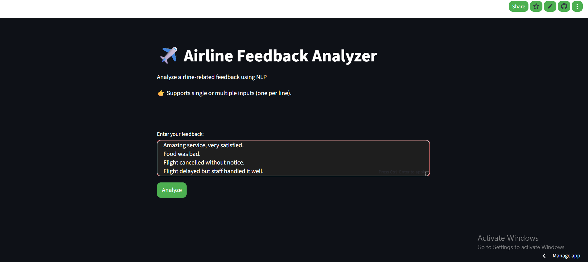
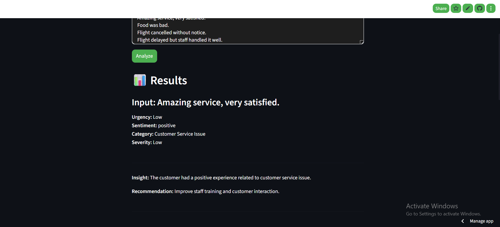
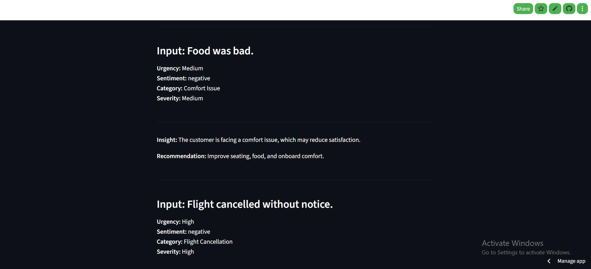
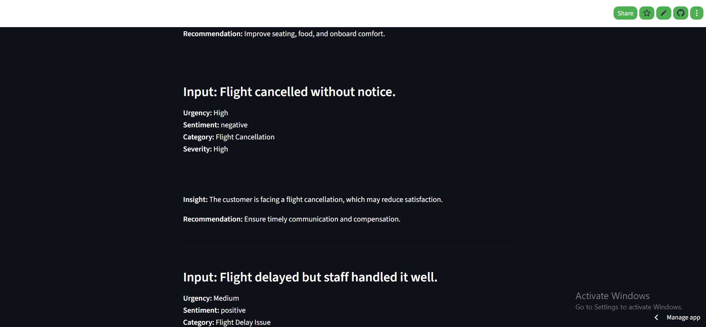
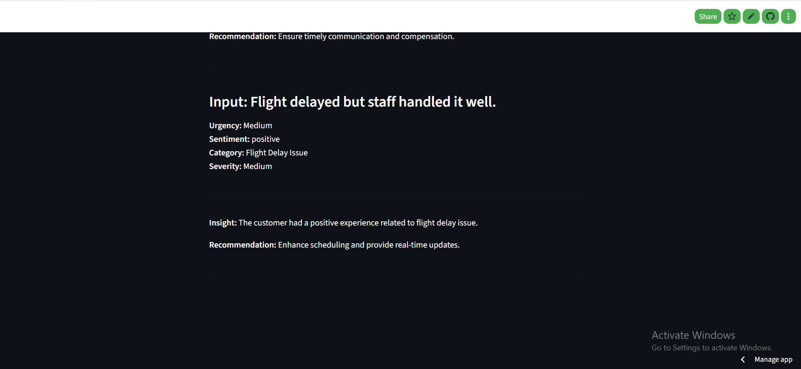

# ✈️ Airline Feedback Analyzer

This project is an **upgraded version** of my previous project, **Airline Sentiment Analyzer**.

The earlier version focused only on predicting sentiment as:

* 😊 Positive
* 😐 Neutral
* 😠 Negative

This improved version goes beyond basic sentiment analysis and provides:

* Sentiment Detection
* Urgency / Priority Detection
* Feedback Category Classification
* Severity Analysis
* Automated Insights
* Recommendations

The application is built using **Streamlit** and powered by a combination of **Deep Learning (LSTM)** and **rule-based NLP analysis**.

---

## 🚀 Live Demo

👉 [Click here to use the app](https://airline-feedback-analyzer-2-redvctpjhwjcvubncbmwkg.streamlit.app/)

📱 **Mobile Users:** If the app shows a blank screen, open the link in Chrome or Safari.

💡 **Try inputs like:**

- "Amazing service, very satisfied"
- "Food was bad"
- "Flight cancelled without notice"
- "Flight delayed by 2 hours but staff handled it well"

---

## 📸 App Preview

Below are screenshots of the Streamlit application and analysis outputs.

### Screenshot 1

### Screenshot 2

### Screenshot 3

### Screenshot 4

### Screenshot 5

---

## 🧠 Model Overview

### Deep Learning Model

* Model Type: LSTM (Long Short-Term Memory)
* Embedding Layer used for word vector representation
* Tokenization and sequence padding applied
* Output Classes:
  - Positive
  - Neutral
  - Negative

### NLP & Rule-Based Analysis

The project also uses custom NLP logic for:

* Category Detection
* Severity Analysis
* Urgency/Priority Detection
* Automated Insights
* Recommendations

---

## ✨ Key Improvements from Previous Version

Compared to the earlier **Airline Sentiment Analyzer**, this upgraded project includes:

✅ Multi-input feedback analysis  
✅ Category classification  
✅ Severity prediction  
✅ Urgency/Priority detection  
✅ Automated recommendations  
✅ Improved feedback analysis logic   

---

## ⚙️ Technologies Used

* Python
* TensorFlow (Keras)
* NLTK
* Pandas
* Scikit-learn
* Streamlit

---

## 📊 Dataset

This project uses the Twitter Airline Sentiment dataset from Kaggle.

Download it from:

https://www.kaggle.com/datasets/crowdflower/twitter-airline-sentiment

After downloading, place the file in the project folder as:
Tweets.csv

---

## 📂 Project Structure

### Core Files

* **app.py** → Streamlit UI (main application)
* **predict.py** → Prediction and feedback analysis logic
* **model.h5** → Trained LSTM model
* **tokenizer.pkl** → Saved tokenizer for preprocessing

### Supporting Files

* **train_model.py** → Model training script
* **requirements.txt** → Project dependencies
* **Tweets.csv** → Dataset
* **README.md** → Project documentation

### Screenshots

* **app_preview/** → Application screenshots
  * screenshot_1.png
  * screenshot_2.png
  * screenshot_3.png
  * screenshot_4.png
  * screenshot_5.png

---

## 🔄 How It Works

1. User enters airline-related feedback
2. Text preprocessing is applied:
   - Lowercasing
   - URL removal
   - Stopword removal
   - Special character cleaning
3. Tokenizer converts text into sequences
4. Sequences are padded to fixed length
5. LSTM model predicts sentiment
6. Rule-based logic determines:
   - Category
   - Severity
   - Urgency
7. Automated insights and recommendations are displayed

---

## 📌 Output Includes

### Sentiment
* Positive  
* Neutral  
* Negative  

### Category Detection
* Flight Delay Issue
* Flight Cancellation
* Baggage Handling Issue
* Customer Service Issue
* Comfort Issue
* General Feedback

### Severity Levels
* Low
* Medium
* High

### Urgency / Priority
* Low
* Medium
* High

### Additional Output
* Automated Insight
* Recommendation for improvement

---

## 🛠️ How to Run Locally

1. Clone the repository:
   git clone https://github.com/sheema-sul/airline_feedback_analyzer_2.0.git

2. Navigate to project folder:
   cd airline_feedback_analyzer

3. Install dependencies:
   pip install -r requirements.txt

4. Run the app:
   streamlit run app.py

---

## 💡 Example

### Input

Flight delayed by 2 hours but staff handled it well

### Output

Urgency: High  
Sentiment: Positive  
Category: Flight Delay Issue  
Severity: High

Insight: The customer had a positive experience related to flight delay issue.
Recommendation: Enhance scheduling and provide real-time updates.

---

## ⚠️ Limitations

* The model is trained mainly on airline-related tweets.
* Some complex sentences may still be misclassified.
* Category and severity detection currently use rule-based logic.
* Accuracy depends on similarity with training data.

---

## 🌟 Future Improvements

* Improve deep learning accuracy
* Add transformer-based NLP models
* Add real-time feedback dashboard
* Expand category detection
* Add multilingual support

---

## 👩‍💻 Author

**Sheema Sultana**  
Aspiring Data Scientist | NLP Enthusiast
